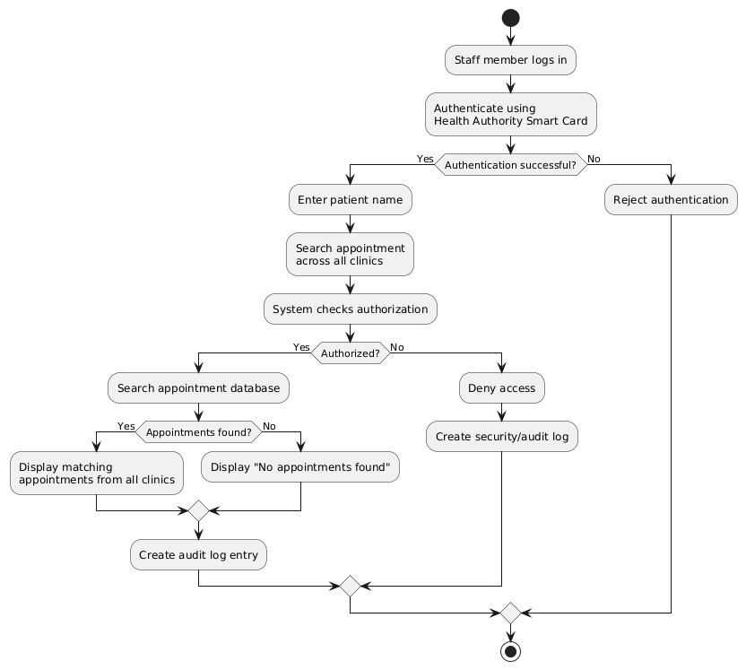

## Activity Diagram — Appointment Search
---
The Appointment Search Activity Diagram describes the workflow used by staff members to search for patient appointments. The process begins with staff authentication using the Health Authority Smart Card and continues with entering a patient's name.

The system checks the user's authorization before searching the appointment database. The search is performed across all clinics simultaneously, ensuring that results are not limited to a previously selected clinic. Every patient-data access is also recorded in the audit log.

This diagram provides a detailed representation of SR-F02 and demonstrates how the access-control and auditing requirements in SR-F04 are applied during the appointment-search process.

Related Requirements: SR-F02, SR-F04, SR-NF02.

