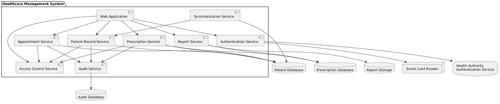

## Component Diagram
---
The Component Diagram describes the major software components of the Healthcare Patient Management System and how they communicate with one another.

The system is divided into components such as the Web Application, Authentication Service, Appointment Service, Patient Record Service, Prescription Service, Report Service, Audit Service, Synchronization Service, and Access Control Service.

The diagram also shows the databases and external authentication service used by these components. Separating the system into components helps demonstrate how functional requirements are implemented while allowing security, auditing, reporting, and synchronization to operate as distinct services.

This diagram is particularly relevant to the system's availability, security, and maintainability requirements.

Related Requirements: SR-F01, SR-F04, SR-F06, SR-F07, SR-NF01, SR-NF03, SR-NF08.
