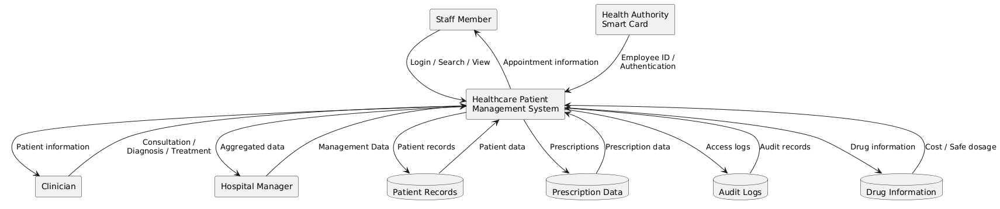

## Data Flow Diagram — Context Level
---
The Context-Level Data Flow Diagram provides a high-level view of how information enters and leaves the Healthcare Patient Management System.

The diagram identifies the main external entities, including Staff Members, Clinicians, Hospital Managers, and the Health Authority Smart Card. It also shows the major data stores used by the system, including patient records, prescription data, drug information, and audit logs.

Staff and clinicians provide authentication and patient-related information to the system, while the system retrieves and stores data in the appropriate data stores. Hospital managers receive aggregated management-level information rather than individual identifiable patient information.

This diagram helps demonstrate the movement and protection of information throughout the system and is particularly relevant to the security, privacy, and data-management requirements.

Related Requirements: SR-F01, SR-F02, SR-F03, SR-F04, SR-F05, SR-F06, SR-F07, SR-NF03, SR-NF06.
