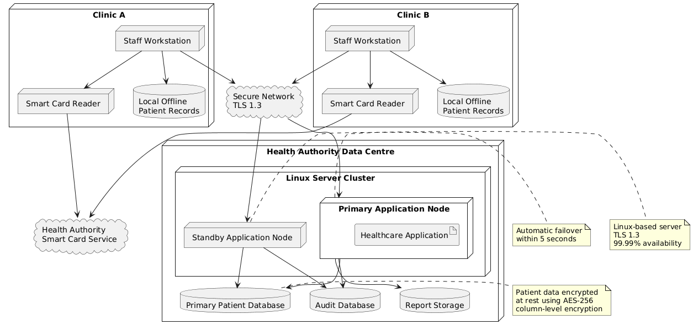

## Deployment Diagram
---
The Deployment Diagram represents the physical deployment of the Healthcare Patient Management System across clinics and the Health Authority data centre.

Each clinic contains staff workstations, smart-card readers, and local storage for offline patient records. The central data centre contains a Linux-based application server cluster, including a primary application node and a standby node.

The diagram shows the secure network connection between clinics and the data centre and identifies the central patient database, audit database, and report storage. It also represents the encryption and failover constraints required by the system.

The standby node provides automatic failover if the primary node fails, supporting the required 99.99% uptime and five-second failover target.

Related Requirements: SR-F07, SR-NF01, SR-NF03, SR-NF04, SR-NF08.
