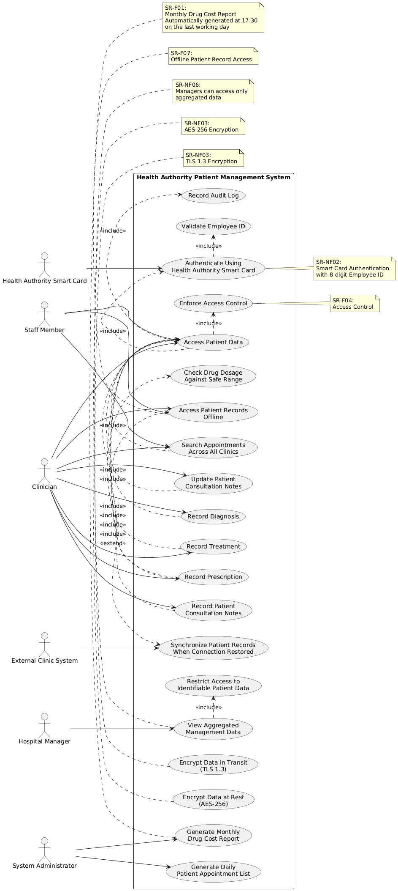

# Use Case Diagram Documentation

This Use Case Diagram outlines the functional boundaries of the system, detailing how various actors interact with core processes while capturing non-functional constraints.

## System Actors

* **Staff Member:** Searches appointments and accesses patient data.
* **Clinician:** Manages consultations, diagnoses, treatments, and prescriptions.
* **Hospital Manager:** Views aggregated management data only.
* **System Administrator:** Generates reports and manages system-related operations.
* **Health Authority Smart Card:** Authenticates staff members.
* **External Clinic System:** Synchronizes offline records with the main system.

---

> **Scope Note:** This diagram focuses primarily on **Functional Requirements** (direct interactions and workflows). **Non-Functional Requirements** (security standards, system performance, and compliance) are integrated as visual constraints and annotations, as NFRs do not represent primary user use cases.
